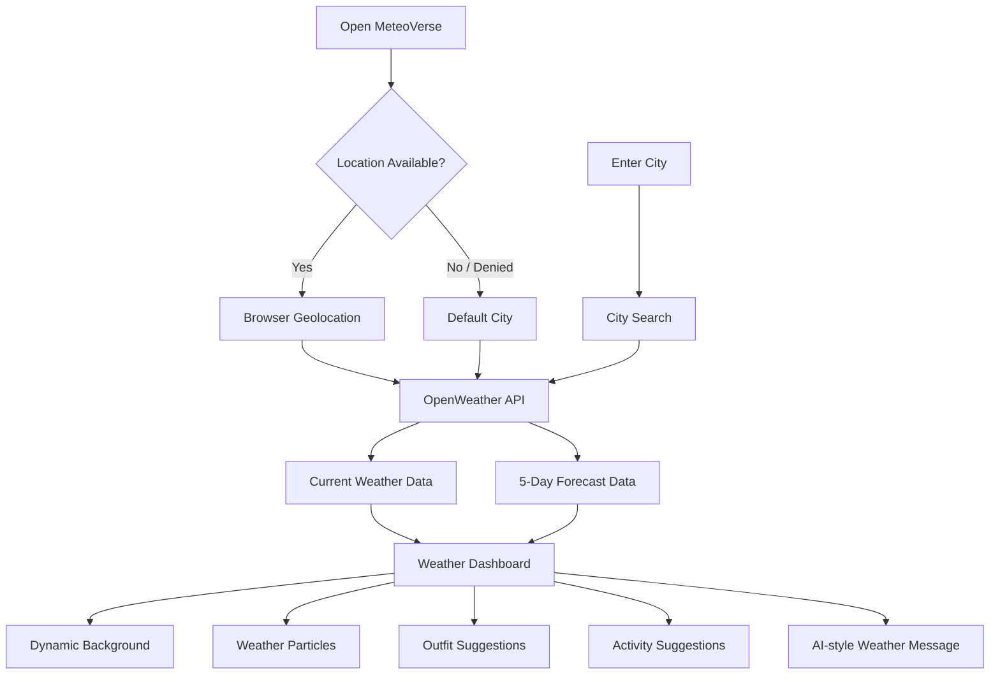

# 🌦️ MeteoVerse — AI Weather Experience

<p align="center">
  <strong>A cinematic, interactive weather dashboard built with pure HTML, CSS and JavaScript.</strong><br/>
  Search any city, use your current location, explore live weather conditions, and get contextual outfit and activity suggestions.
</p>

<p align="center">
  <a href="https://github.com/AkshatRaj00/Weather-App">Repository</a> ·
  <a href="https://github.com/AkshatRaj00/Weather-App/issues">Issues</a>
</p>

---

## ✨ Overview

**MeteoVerse** is a single-page weather application designed to make weather information more engaging than a traditional forecast screen.

It combines live weather data with an animated UI, glassmorphism cards, dynamic backgrounds, weather particles, contextual recommendations, and a short-range forecast — all inside a single `index.html` file.

The project is intentionally lightweight: there is **no framework, bundler, build process, or package installation required**.

## 🚀 Features

### 🌍 Weather Search
- Search weather by city name.
- Press **Enter** or use the search button to fetch weather.
- Automatically attempts to use the browser's current location.

### 🌡️ Live Weather Information
Displays useful conditions including:
- Current temperature
- Feels-like temperature
- Weather condition
- Humidity
- Wind speed
- Atmospheric pressure
- Visibility
- Sunrise and sunset
- Location information

### 🔮 5-Day Forecast
- Daily forecast cards
- High and low temperature
- Weather icons
- Human-friendly day labels such as **Today** and **Tomorrow**

### 🤖 Contextual Weather Assistant
The interface generates weather-aware messages and recommendations, including:
- Weather commentary
- Outfit suggestions based on temperature
- Activity suggestions based on weather conditions
- Mood-oriented contextual messages

### 🎨 Dynamic Visual Experience
- Glassmorphism UI
- Animated gradient background
- Weather-specific background gradients
- Floating weather icons
- Particle animations
- Hover and touch interactions
- Responsive mobile layout
- Subtle card tilt effects

### 📱 Browser Features
- Geolocation support
- Optional browser notifications
- Keyboard shortcut: `Ctrl + /` focuses the city search field
- Mobile touch interaction support

---

## 🧠 How It Works



## 🏗️ Architecture

```text
Browser
   │
   ├── index.html
   │    ├── HTML Structure
   │    ├── CSS / Animations
   │    └── JavaScript Logic
   │
   ├── Browser Geolocation API
   │
   └── OpenWeather API
          ├── Current Weather
          └── 5-Day Forecast
```

The main application logic is encapsulated in the `WeatherApp` JavaScript class.

## 🛠️ Tech Stack

| Technology | Purpose |
|---|---|
| **HTML5** | Application structure |
| **CSS3** | Glassmorphism, responsive layout and animations |
| **JavaScript (ES6+)** | Application logic and API integration |
| **OpenWeather API** | Weather and forecast data |
| **Geolocation API** | Detect user's current location |
| **Browser Notifications API** | Optional weather notifications |
| **Google Fonts** | Orbitron and Inter typography |

## 📁 Project Structure

```text
Weather-App/
├── .github/
├── docs/
│   └── ARCHITECTURE.md
├── index.html
├── LICENSE
├── README.md
└── .gitignore
```

## ⚡ Getting Started

### 1. Clone the repository

```bash
git clone https://github.com/AkshatRaj00/Weather-App.git
cd Weather-App
```

### 2. Run locally

This is a static client-side application, so there is no build step.

You can open `index.html` directly in a browser, or serve it with a local web server:

```bash
python -m http.server 5500
```

Then open:

```text
http://localhost:5500
```

### 3. API Configuration

The application uses the **OpenWeather API**.

For your own deployment, create an API key through OpenWeather and keep the key out of public source control whenever possible.

## 🔐 Security Note

Do **not** commit a production API key directly into a public repository.

For production, move API requests behind a server-side endpoint or secure proxy so the secret key is not exposed in browser source.

## 🎯 Project Goals

MeteoVerse was built to explore how a lightweight frontend project can combine:

- Real-time external APIs
- Browser capabilities
- Responsive web design
- Animation and interaction
- Context-aware UI
- Data transformation
- User-friendly weather presentation

The goal is not only to show weather data, but to turn that data into a more immersive experience.

## 💡 Future Improvements

- Hourly forecast visualization
- Weather charts and graphs
- Air Quality Index (AQI)
- UV index
- Weather alerts
- Multi-city favourites
- Theme persistence
- Better accessibility support
- Secure backend API proxy
- PWA / offline support
- Celsius/Fahrenheit switching

## 🤝 Contributing

Contributions are welcome.

1. Fork the repository.
2. Create a feature branch.
3. Make your changes.
4. Test the application.
5. Open a pull request with a clear description.

## 📄 License

This project is distributed under the license included in this repository.

## 👨‍💻 Author

**Akshat Raj**

GitHub: [@AkshatRaj00](https://github.com/AkshatRaj00)

---

<p align="center">
  🌤️ <strong>MeteoVerse</strong> — Weather data, redesigned as an experience.
</p>
